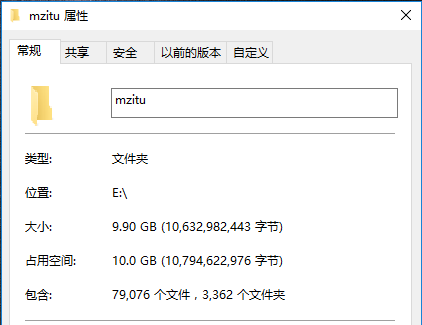
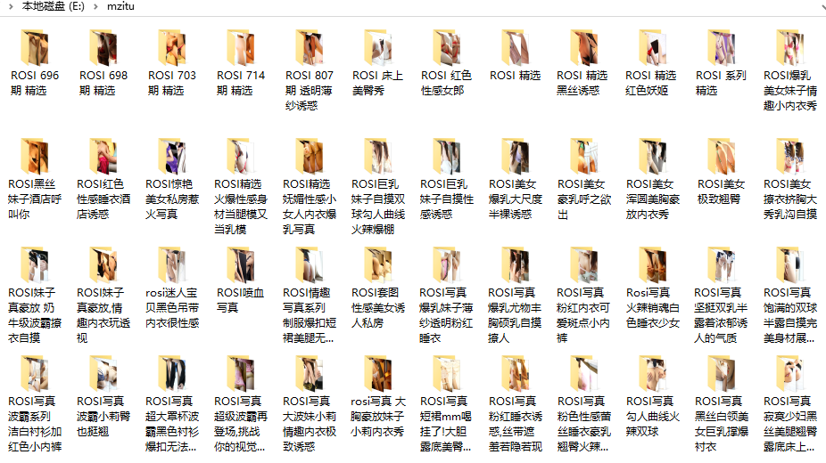
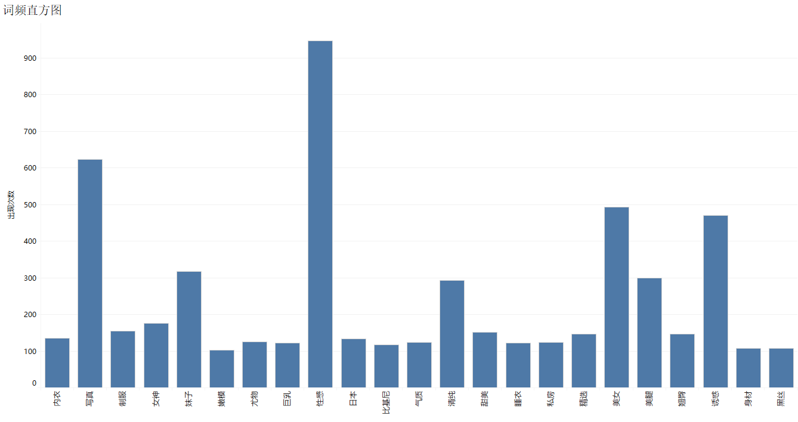
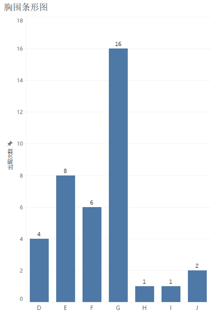
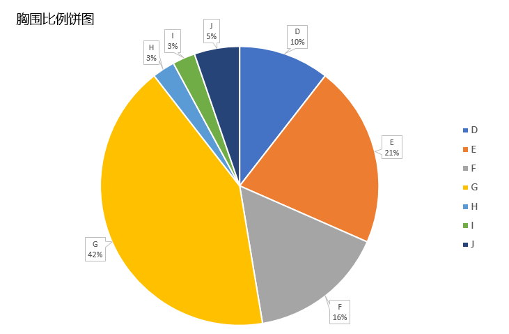

# 美女写真套图爬虫（二）

### 传送门：[美女写真套图爬虫（一）](https://github.com/chenjiandongx/mmjpg)  

爬取网站 : [http://www.mzitu.com](http://www.mzitu.com)  

爬取全站 3000 多套图片，整整 **10** 个G  

有图有真相

  

共 **79076** 张图片，假设你在每张图片上停留的时间为 **2** 秒，你需要连续看 **2636** 分钟，也就是 **43.9** 个小时才能看完。身体要紧不能太拼命！  

  

以为这样就完了？
> too young too simple sometimes naive!    

  

我对套图名字产生了兴趣 将套图名分词后统计词频并进行处理 对词频数超过 100 的词语生成条形图

  

看来命名也就要讲究技巧的 名字一定要足够吸引眼球   
**性感** **写真** **美女** **诱惑** **妹子** 这五个词拿下前五名 得票均超过 300，**美腿** **清纯** **女神** 紧跟其后，岛国 **日本** 也出现在其中，**嫩模** 以 102 票搭上了末班车

然后我又统计了代表着妹子胸围的 **字母** 生成了条形图

**G** 真的是一柱擎天，**E** 和 **F** 排在第二梯队。我们再来看看**胸围**的百分比情况  

  

G 的比例是最大的，高达 **42%**，E 加上 F 也基本上有半壁江山了

  

视觉冲击还不够大？ 那来一张词云吧

  

这图真的不忍直视阿  

  

最后请允许我真心说一句  

  
